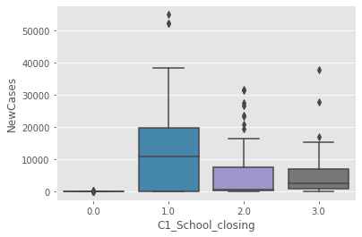
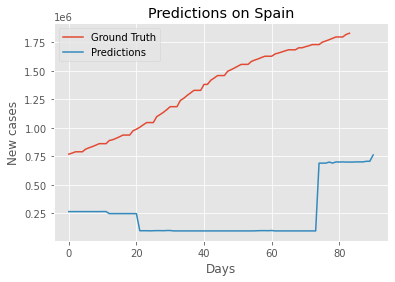
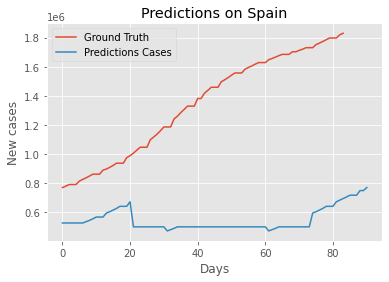
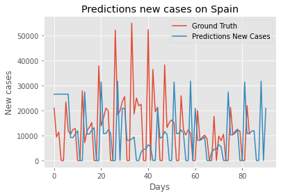

# xPrize Challenge: Pandemic Response Challenge
In this project I describe my attempts and process to develop a predictor model. 

## Data 
The input data is from the [Oxford Dataset](https://github.com/OxCGRT/covid-policy-tracker/tree/master/data).
This dataset is formed by 26 columns. These columns consist of information related with covid-19 policies by country. 
I first focused on the data. I tried to clean it and understand it. I also did some typical data processing steps like specifying the type. 
I realized some of the features were not important and we could drop them. 
I also found out that some countries had a lot of NaN data. 
I created new columns for the date, diving it in day, month and year to see if taking into acount the month in the model could help to predict. 
I also decided to drop the columns related to the flag. 

### Dealing with missing values
I decided to fill the missing values with the previous value. All of the columns about the measurements taken by each country has a lot of missing values. In these columns taking the previous value seems reasonable, because it means taken the same measure as it was the day before.

With ConfirmedCases and Confirmed Deaths I also fill with the previous values. 

### Feature Importances
I tried to check the feature importances with a Random Forest Regressor model. 
First I did it with France, and then with the other countries. As it was expected, the most important feature was Confirmed Deaths. 

### Feature Engineering
I created new features that were the lineal combination of the categorical variables and their flag variable. For example, the variable C1_School_closing and the varibale C1_Flag. The first one is a categorical variable from 0 to 4 and the second one indicates if the measure was taken in the whole country or just in some areas. With this, I tried to give a weight depending on the flag. 

## Model
I performed an Ada Boost Regressor with the Scikit-learn implementation. I decided to implement this algorithm because it is good with noisy data and it could work well with our dataset. 
I trained a simple AdaBoostRegressor with the hyperparameters: *DecisionTreeRegressor(max_depth=6), n_estimators=500*.
As it is a timeseries problem, it is not interesting to choose randomly, as it is important to take into account the time. 
The model is trained by the following features: *'C1_School_closing', 'C1_Flag', 'C2_Workplace_closing', 'C2_Flag', 'C3_Cancel_public_events', 'C3_Flag', 'C4_Restrictions_on_gatherings', 'C4_Flag', 'C5_Close_public_transport', 'C5_Flag', 'C6_Stay_at_home_requirements', 'C6_Flag', 'C7_Restrictions_on_internal_movement', 'C7_Flag', 'C8_International_travel_controls', 'E1_Income_support', 'E1_Flag', 'E2_Debt_contract_relief', 'E3_Fiscal_measures', 'E4_International_support', 'H1_Public_information_campaigns', 'H1_Flag', 'H2_Testing_policy', 'H3_Contact_tracing', 'H4_Emergency_investment_in_healthcare', 'H5_Investment_in_vaccines', 'H6_Facial_Coverings', 'H6_Flag', 'H7_Vaccination_policy', 'H7_Flag', 'Month', 'Year', 'Day'*. 
The model is trained with the data until 30 of September, and then it predicts for October, November and December. 
I tried to do the model with the weights for the flags and categorical variables, but the results were worse. 

## Learnings
For me, this has been my fisrt participation in a challenge. It has been interesting and different to work in it, but I enojoyed it. I have learned how to work with a big group of people in the same project and how AdaBoost works. 

## Future work
I would like to perform this same model with more variables and see if the results are different. 
I think using a Neural Network could be also interesting, even though it may not work really well.

## Graphs
In the next image, we can observe the distribution of New cases depending on the type of School Closing policy that was applied in Spain.

The policies were 0 for no measures, 1 for recommend closing, 2 for required closing in some levels and 3 for closing in all levels. 
In the image, we can see that with no measures there were little cases taking place, this is because no measures was taken during the beggining of the year, when covid was not in Spain or there were not a lot of cases. 
Then we can see that when closing schools, the number of new cases was reduced. 

The next image is for the new cases in Spain related to Facial coverings policies.

In this case, 0 is for no measures, 1 recommended, 2 required in some specific public spaces, 3 required in all public spaces, 4 required outside the home.
It is interesting to see that there is a lot of new cases even with the type 4 of policy. This is because in Spain, facial masks were mandatory since May, so even with the new waves, facial mask policies were the same. 
This image is an example when having more information about the topic or the situation can improve understanding the data. 

Now, let's see the prediction plot for Spain.

I performed the model for all the countries to predict the number of Confirmed Cases. Then, I plot the result only for Spain.
The results are not good, and improving this model is possible. It didn't even have a the same tendency for the predicitons. 
I also anted to see if the result will improve if I trained the model only with Spain data.

In this case, the prediction improved a little bit, but it is still not good.

However, the model performs better if we predict the New Cases. In this cases I trained the model only with Spain data and tried to predict New Cases.

